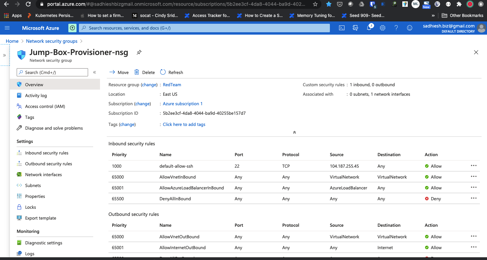

## Automated ELK Stack Deployment

The files in this repository were used to configure the network depicted below.

  

(https://drive.google.com/file/d/1aYhf1-sAm65dNcFu-P8xyskQNVWHvi6N/view?usp=sharing)

These files have been tested and used to generate a live ELK deployment on Azure. They can be used to either recreate the entire deployment pictured above. Alternatively, select portions of the `yaml` file may be used to install only certain pieces of it, such as Filebeat.

  - _TODO: Enter the playbook file._

This document contains the following details:
- Description of the Topology
- Access Policies
- ELK Configuration
  - Beats in Use
  - Machines Being Monitored
- How to Use the Ansible Build

### Description of the Topology

The main purpose of this network is to expose a load-balanced and monitored instance of DVWA, the D*mn Vulnerable Web Application.

Load balancing ensures that the application will be highly available, in addition to restricting access / traffic to the network.

- Load balancers channel all traffic into requested workloads running on only configured backend pools, leading to high availability by balancing requests across the pools based on availability and as well restricting access to specific ports / source IPs based on Network Security Policies (NSG) configured.
- Jumpbox provides a well controlled, monitored and hardened device to access the Azure Network and VMs in the subscription, and in turn restricting the attack surface by routing all administrative user traffic through this single entry point.

Integrating an ELK server allows users to easily monitor the vulnerable VMs for changes to the system log files and system resources.

The configuration details of each machine may be found below.
_Note: Use the [Markdown Table Generator](http://www.tablesgenerator.com/markdown_tables) to add/remove values from the table_.

| Name     | Function | IP Address | Operating System |
|----------|----------|------------|------------------|
| Jump Box | Gateway  | 10.1.0.4   | Linux            |
| Web-1    | Webserver| 10.1.0.5   | Linux            |
| Web-2    | Webserver| 10.1.0.5   | Linux            |
| Elk-2    | ELK Server| 10.0.0.4   | Linux            |
 

### Access Policies

The machines on the internal network are not exposed to the public Internet. 

Only the Jumpbox virtual machine can accept any SSH connections from the Internet. Access to this machine is only allowed from the following IP addresses:
- 104.187.255.45 

Machines within the network can only be accessed by Jumpbox VM.
- ELK VM is accessed only from Single server facing internet, and VMs running within the subscription defined by the vNET subnet range.
- Public IP: 104.187.255.45 is allowed TCP/HTTP access to ELK VM on port 5601 for Kibana access and 9200 for querying Elasticsearch
- Also, ELK VM are allowed access from 10.1.0.0/24 CIDR which is part of RED Team VNET running in remote region to access ports 22 (ssh), 5601(kibana), 9200(elasticsearch), 5044(logstash).

A summary of the access policies in place can be found in the table below.

| Name     | Publicly Accessible | Allowed IP Addresses |
|----------|---------------------|----------------------|
| Jump Box | Yes                 | 104.187.255.45:22    |
| Jump Box | No                 | Any VNETs, Azure Loadbalancers    |
| ELK NSG  | Yes                 | 104.187.255.45 : 5601,9200          |
| ELK NSG  | No                 | 10.1.0.0/24 : 22,5601,9200 |

### Elk Configuration

Ansible was used to automate configuration of the ELK machine. No configuration was performed manually, which is advantageous because...
- Its fully automated and repeatable
- Could be version controlled as IaC
- Scale to 100's of servers with same effort

The playbook implements the following tasks:
- Preps VM - setting VM Max Memory
- Installs Pip, Python modules dependency for Docker
- Downloads Docker and installs docker daemon
- Download and Install ELK Container and expose web ports of ELK (9200,5601,5044)
- Finally set the Docker as a system service / daemon

The following screenshot displays the result of running `docker ps` after successfully configuring the ELK instance.

### Target Machines & Beats
This ELK server is configured to monitor the following machines:
- Web-1 / 10.1.0.5
- Web-2 / 10.1.0.6

We have installed the following Beats on these machines:
- Filebeat : To scrape all system logs from monitored server to publish to ELK
- Metricbeat : To scrape system resources utilization periodically and publish to ELK

These Beats allow us to collect the following information from each machine:
- **Filebeat :** Can tail any log files, but here specifically we tail all system logs, auth logs, security logs, etc.. to register every login, system activity, etc.

- **Metricbeat :** It collects all system runtime metrics of all resources from cpu, memory, network, process information, etc.. and logs everything in timeseries collection in ELK. It stores a point in time snapshot of all processes that was running, CPU load, network connections, memory footprint, etc.. 

### Using the Playbook
In order to use the playbook, you will need to have an Ansible control node already configured. Assuming you have such a control node provisioned: 

SSH into the control node and follow the steps below:
- Copy the playbook yaml files to `/etc/ansible`.
- Update the `hosts` inventory file under `etc/ansibles` to include the target servers under appropriate group. 
- For ELK you can add hosts under a group *ELK* and refer the group in playbook for any activities to be performed.
- For monitoring VMs with beats, you can use group *webservers* in playbook to install filebeat and metricbeat
- Run the playbook, and navigate to http://<elk-vm-public-ip>:5601, which should open Kibana App to check that the installation worked as expected.

Additionally:
- You can run `ansible-playbook <<playbook.yml>>`  to execute a playbook

